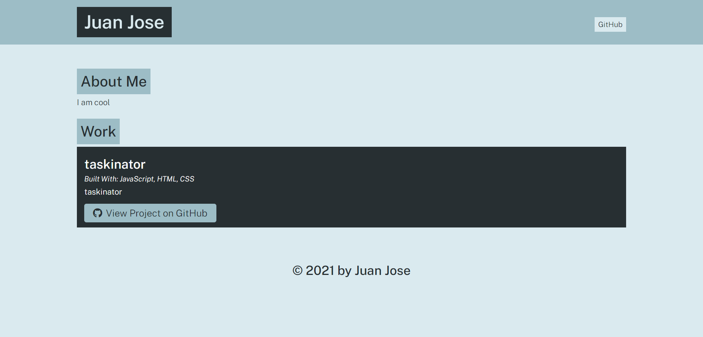

# portfolio-generator

## Description 

This app is designed to take user inputs and create a portofolio with information provided.

## Table of Contents

* [Installation](#installation)
* [Usage](#usage)
* [Credits](#credits)
* [License](#license)

## Installation

1. Download or clone Repo from Github.
2. Open the terminal and change directories until you are in the root folder of the app.js
3. While in the root folder run `npm install` to install the dependencies (inquirer) that the app.js uses.

## Usage 

1. Open terminal
2. Change Directories until you are in the root folder of the app.js
3. Once you are in the root folder run the command `node app.js` to initiate the app
4. The app will ask a series of questions (title,description,collaborates..etc)
5. Please fill out all the questions.
6. Once you finish responding all the questions the app will generate a portfolio html file and output it in the dist folder.

**Below is the source code for the portfolio generator in GitHub. Please note that code is in app.js. **
        https://github.com/darkjuanjo/weather-dashboard

### Generated Portfolio Screenshot!

## Credits

[Juan Jose Paz](https://github.com/darkjuanjo)

## License

MIT
    